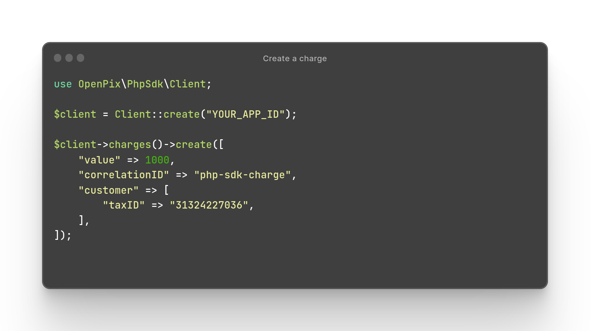

# OpenPix PHP SDK
<p>
    <a href="https://packagist.org/packages/open-pix/php-sdk">
        <image src="https://img.shields.io/packagist/php-v/open-pix/php-sdk?color=%2325c2a0&logo=php&label=open-pix/php-sdk">
    </a>
    <a href="https://packagist.org/packages/open-pix/php-sdk">
        <image src="https://img.shields.io/packagist/dt/open-pix/php-sdk?color=%2325c2a0&logo=php">
    </a>
</p>

Welcome to the OpenPix PHP SDK! This SDK provides convenient access to the OpenPix REST API, allowing you to easily integrate payment services into your PHP applications.

<p align="center">
    
</p>

## Documentation
See [SDK documentation](https://developers.openpix.com.br/docs/sdk/php/sdk-php-what-is) and [Rest API documentation](https://developers.openpix.com.br/api).

## Installation
Install the SDK with the necessary dependencies using Composer:
```bash
$ composer require open-pix/php-sdk guzzlehttp/guzzle guzzlehttp/psr7
```

## Basic usage

Here is the basic usage of the SDK. See [SDK documentation](https://developers.openpix.com.br/docs/sdk/php/sdk-php-usage) for more details.
```php
use OpenPix\PhpSdk\Client;

$client = Client::create("YOUR_APP_ID");

// Create a customer.
$customer = [
    "name" => "Dan PHP-SDK",
    "taxID" => "",
    "email" => "email0@example.com",
    "phone" => "5511999999999",
    "correlationID" => "test-php-sdk-customer-" . mt_rand(1, 10000),
];

$client->customers()->create($customer);

// Create a charge using above customer.
$charge = [
    // Charge value. 
    "value" => 1000, // (R$ 10,00)

    // Your correlation ID to keep track of this charge.
    "correlationID" => "test-php-sdk-charge-" . mt_rand(1, 10000),
    
    // Charge customer.
    "customer" => $customer,
];

$result = $client->charges()->create($charge);

// Get the generated dynamic BR code to be rendered as a QR Code. 
echo $result["brCode"] . "\n";
```

## Contributing
We welcome contributions to the OpenPix PHP SDK! If you would like to contribute, please follow these steps:

- Fork the repository
- Create a new branch for your feature or bug fix
- Write your code and tests
- Commit your changes and push your branch to GitHub
- Submit a pull request

Please make sure to adhere to the [code of conduct](#code-of-conduct).

## Code of Conduct
Our Pledge
We pledge to make participation in our project and our community a harassment-free experience for everyone, regardless of age, body size, disability, ethnicity, gender identity and expression, level of experience, nationality, personal appearance, race, religion, or sexual identity and orientation.

Our Standards
Examples of behavior that contributes to creating a positive environment include:

Using welcoming and inclusive language
Being respectful of differing viewpoints and experiences
Gracefully accepting constructive criticism
Focusing on what is best for the community
Showing empathy towards other community members
Examples of unacceptable behavior by participants include:

The use of sexualized language or imagery and unwelcome sexual attention or advances
Trolling, insulting/derogatory comments, and personal or political attacks
Public or private harassment
Publishing others' private information, such as a physical or electronic address, without explicit permission
Other conduct which could reasonably be considered inappropriate in a professional setting
Our Responsibilities
As project maintainers, we are responsible for clarifying the standards of acceptable behavior and are expected to take appropriate and fair corrective action in response to any instances of unacceptable behavior.

As contributors, you have the responsibility to adhere to these standards and report any instances of unacceptable behavior.

Enforcement
Instances of abusive, harassing, or otherwise unacceptable behavior may be reported to the project team at <developers@woovi.com>. The project team will review and investigate all complaints and will respond in a way that it deems appropriate to the circumstances. The project team is obligated to maintain confidentiality with regard to the reporter of an incident. Further details of specific enforcement policies may be posted separately.

Project maintainers who do not follow or enforce the code of conduct in good faith may face temporary or permanent repercussions as determined by other members of the project's leadership.

Attribution
This Code of Conduct is adapted from the Contributor Covenant, version 1.4, available at http://contributor-covenant.org/version/1/4.

## License
MIT License.
